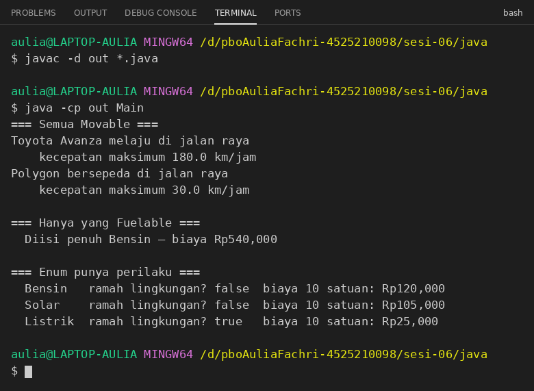
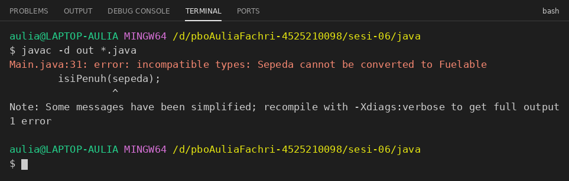
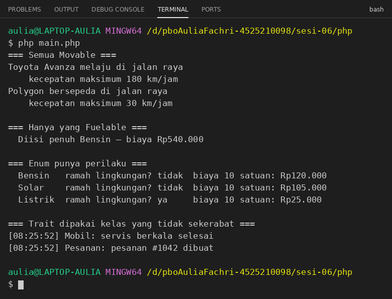

# Laporan Praktikum Sesi 6: Abstract Class, Interface, Enum, dan Trait

| | |
|---|---|
| **Nama** | Aulia Fachri |
| **NIM** | 4525210098 |
| **Program Studi** | Teknik Informatika |
| **Universitas** | Universitas Pancasila |
| **Sub-CPMK** | Sub-CPMK-P4: mengimplementasikan abstraksi melalui abstract class, interface, enum, dan trait |
| **Bahasa** | Java dan PHP (PHP 8.1 ke atas karena memakai enum) |

## Tujuan

1. Memisahkan kemampuan (interface) dari identitas (abstract class) pada satu domain.
2. Mengimplementasikan beberapa interface pada satu kelas.
3. Mengganti konstanta status dengan enum yang punya perilaku.
4. Menggunakan trait di PHP dan mengenali batas kewajarannya.

## Struktur Berkas

```text
sesi-06/
├── java/
│   ├── Movable.java
│   ├── Fuelable.java
│   ├── TipeBahanBakar.java
│   ├── Kendaraan.java
│   ├── Mobil.java
│   ├── Sepeda.java
│   └── Main.java
├── php/
│   ├── abstraksi.php
│   └── main.php
├── keputusan.md
└── img/
```

## Cara Menjalankan

```bash
# Java
cd sesi-06/java
javac -d out *.java
java -cp out Main

# PHP
cd ../php
php main.php
```

---

## 1. Interface dan Abstract Class

`Kendaraan` dibuat sebagai **abstract class** karena semua kendaraan punya kode yang benar-benar sama (merek, tahun, dan perhitungan umur). `Movable` dan `Fuelable` dibuat sebagai **interface** karena keduanya menjelaskan kemampuan, bukan identitas benda. Tidak semua yang bergerak butuh bahan bakar (sepeda), dan tidak semua yang butuh bahan bakar bergerak (generator). Pemisahan ini adalah Interface Segregation Principle. Alasan lengkap tiap keputusan ada di `keputusan.md`.


**`java/Movable.java`**

```java
/**
 * Sesi 6 — kontrak "bisa bergerak".
 * Interface menjawab: APA YANG BISA dilakukan, bukan APA benda ini.
 */
public interface Movable {

    void bergerak();

    double kecepatanMaksimum();

    /**
     * Default method menyediakan ringkasan umum yang dapat di-override
     * kalau kelas implementor butuh versi khusus.
     */
    default String ringkasanGerak() {
        return "kecepatan maksimum " + kecepatanMaksimum() + " km/jam";
    }
}
```

**`java/Fuelable.java`**

```java
/**
 * Kontrak "bisa diisi bahan bakar".
 *
 * Sengaja DIPISAH dari Movable: tidak semua yang bergerak butuh bahan bakar
 * (sepeda), dan tidak semua yang butuh bahan bakar bergerak (generator).
 * Inilah Interface Segregation Principle.
 */
public interface Fuelable {
    void isiBahanBakar(double jumlah);
    double kapasitasTangki();
    TipeBahanBakar tipeBahanBakar();
}
```

**`java/Kendaraan.java`**

```java
/**
 * Abstract class: menampung kode yang BENAR-BENAR SAMA di semua kendaraan.
 * Bandingkan perannya dengan interface Movable dan Fuelable.
 */
public abstract class Kendaraan {

    protected final String merek;
    protected final int tahun;

    protected Kendaraan(String merek, int tahun) {
        this.merek = merek;
        this.tahun = tahun;
    }

    /** Umur kendaraan, tidak boleh negatif. */
    public int umur(int tahunSekarang) {
        if (tahunSekarang < tahun) {
            return 0;
        }
        return tahunSekarang - tahun;
    }

    public abstract int jumlahRoda();

    @Override
    public String toString() {
        return String.format("%s (%d, %d roda)", merek, tahun, jumlahRoda());
    }
}
```

`Movable` punya *default method* `ringkasanGerak()` sehingga kelas yang mengimplementasikannya otomatis mendapat ringkasan kecepatan tanpa menulis ulang.

## 2. Enum dengan Perilaku

Enum `TipeBahanBakar` membatasi nilai yang valid hanya pada tiga konstanta (`BENSIN`, `SOLAR`, `LISTRIK`). Tiap konstanta membawa label dan harga per satuan, dan enum punya method `biayaPengisian()` serta `ramahLingkungan()`. Dengan konstanta `int`, nilai seperti `99` bisa lolos begitu saja, sedangkan enum langsung ditolak kompilator.


**`java/TipeBahanBakar.java`**

```java
/**
 * Enum: hanya nilai yang terdaftar di sini yang mungkin ada.
 * Bandingkan dengan `public static final int BENSIN = 1;`
 * yang membiarkan angka 99 lolos begitu saja.
 */
public enum TipeBahanBakar {

    BENSIN("Bensin", 12000),
    SOLAR("Solar", 10500),
    LISTRIK("Listrik", 2500);

    private final String label;
    private final double hargaPerSatuan;

    TipeBahanBakar(String label, double hargaPerSatuan) {
        this.label = label;
        this.hargaPerSatuan = hargaPerSatuan;
    }

    public String getLabel() { return label; }

    public double biayaPengisian(double jumlah) {
        return jumlah * hargaPerSatuan;
    }

    public boolean ramahLingkungan() {
        return this == LISTRIK;
    }
}
```

## 3. Dua Interface pada Satu Kelas

`Mobil` mewarisi satu kelas (`Kendaraan`) dan mengimplementasikan dua interface (`Movable` dan `Fuelable`). Java hanya mengizinkan satu `extends` karena pewarisan kelas harus linear dengan satu hierarki induk, sedangkan interface hanya berupa kontrak sehingga boleh digabung sebanyak apa pun. Karena itu objek `Mobil` bisa ditampung dalam variabel bertipe `Kendaraan`, `Movable`, maupun `Fuelable`.


**`java/Mobil.java`**

```java
/**
 * Satu kelas boleh mewarisi SATU class, tetapi mengimplementasikan BANYAK interface.
 * Tuliskan di keputusan.md: mengapa Java membuat aturan seperti itu?
 */
public class Mobil extends Kendaraan implements Movable, Fuelable {

    private final double kapasitasTangki;
    private double isiTangki = 0;

    public Mobil(String merek, int tahun, double kapasitasTangki) {
        super(merek, tahun);
        this.kapasitasTangki = kapasitasTangki;
    }

    @Override public int jumlahRoda() { return 4; }

    @Override public void bergerak() {
        System.out.printf("%s melaju di jalan raya%n", merek);
    }

    @Override public double kecepatanMaksimum() { return 180; }

    @Override public void isiBahanBakar(double jumlah) {
        if (jumlah <= 0) {
            throw new IllegalArgumentException("Jumlah bahan bakar harus lebih dari 0");
        }

        double ruangKosong = kapasitasTangki - isiTangki;
        if (jumlah > ruangKosong) {
            throw new IllegalArgumentException("Jumlah bahan bakar melebihi kapasitas tangki");
        }

        isiTangki += jumlah;
    }

    @Override public double kapasitasTangki() { return kapasitasTangki; }

    @Override public TipeBahanBakar tipeBahanBakar() { return TipeBahanBakar.BENSIN; }

    public double getIsiTangki() { return isiTangki; }
}
```

## 4. Sepeda dan Interface Segregation

`Sepeda` hanya mengimplementasikan `Movable`, **bukan** `Fuelable`.


**`java/Sepeda.java`**

```java
public class Sepeda extends Kendaraan implements Movable {

    public Sepeda(String merek, int tahun) {
        super(merek, tahun);
    }

    @Override
    public int jumlahRoda() {
        return 2;
    }

    @Override
    public void bergerak() {
        System.out.printf("%s bersepeda di jalan raya%n", merek);
    }

    @Override
    public double kecepatanMaksimum() {
        return 30;
    }
}
```

Method `isiPenuh()` di `Main` menerima parameter bertipe `Fuelable`, bukan `Mobil`. Method ini hanya peduli kontraknya, sehingga kelas baru yang `implements Fuelable` langsung bisa dipakai tanpa mengubah method tersebut.


**`java/Main.java`**

```java
import java.util.List;

public class Main {

    /**
     * Perhatikan tipe parameternya: Fuelable, bukan Mobil.
     * Method ini tidak peduli kelas konkretnya — hanya peduli kontraknya.
     * Kelas baru yang implements Fuelable langsung bisa dipakai di sini,
     * tanpa menyunting satu baris pun.
     */
    static void isiPenuh(Fuelable kendaraan) {
        kendaraan.isiBahanBakar(kendaraan.kapasitasTangki());
        double biaya = kendaraan.tipeBahanBakar().biayaPengisian(kendaraan.kapasitasTangki());
        System.out.printf("  Diisi penuh %s — biaya Rp%,.0f%n",
                kendaraan.tipeBahanBakar().getLabel(), biaya);
    }

    public static void main(String[] args) {
        Mobil mobil = new Mobil("Toyota Avanza", 2022, 45);
        Sepeda sepeda = new Sepeda("Polygon", 2024);

        System.out.println("=== Semua Movable ===");
        for (Movable m : List.of(mobil, sepeda)) {
            m.bergerak();
            System.out.println("    " + m.ringkasanGerak());
        }

        System.out.println();
        System.out.println("=== Hanya yang Fuelable ===");
        isiPenuh(mobil);

        System.out.println();
        System.out.println("=== Enum punya perilaku ===");
        for (TipeBahanBakar t : TipeBahanBakar.values()) {
            System.out.printf("  %-8s ramah lingkungan? %-5s  biaya 10 satuan: Rp%,.0f%n",
                    t.getLabel(), t.ramahLingkungan(), t.biayaPengisian(10));
        }
    }
}
```

### Hasil Running Java

Perintah: `javac -d out *.java` lalu `java -cp out Main`



Program mencetak semua `Movable` (mobil dan sepeda), mengisi penuh hanya objek `Fuelable` (mobil), lalu menampilkan ketiga nilai enum dengan biaya dan status ramah lingkungan yang berbeda. Pemisah ribuan pada biaya (`540,000` atau `540.000`) mengikuti pengaturan locale komputer yang menjalankan `printf`.

### Pesan Kompilator untuk `isiPenuh(sepeda)`

Untuk pengujian, baris `isiPenuh(sepeda);` ditambahkan sementara ke `Main.java`, lalu dikompilasi:



Kompilator menolak dengan pesan `incompatible types: Sepeda cannot be converted to Fuelable`. Penolakan di tahap kompilasi menguntungkan karena kesalahan kontrak tertangkap sejak awal, sebelum program berjalan. Objek yang tidak layak untuk suatu operasi tidak pernah sampai ke runtime dan tidak menimbulkan bug yang sulit dilacak. Baris pengujian tersebut sudah dihapus lagi dari `Main.java`.

---

## 5. Implementasi PHP

Struktur yang sama dibuat di PHP dalam satu berkas `abstraksi.php`. Beberapa hal yang berbeda dari Java:

- **Enum** di PHP 8.1 ke atas adalah *backed enum* bertipe `string`, dengan `match` untuk label dan harga.
- **Trait `Loggable`** menyediakan method `log()` yang dipakai ulang oleh `Mobil` dan `Pesanan`, dua kelas yang tidak berkerabat. Inilah penggunaan ulang horizontal.
- **Constructor promotion dan `readonly`** menggantikan deklarasi properti `final` plus assignment di constructor Java.
- **`declare(strict_types=1)`** membuat pemeriksaan tipe parameter dan nilai kembalian lebih ketat.


**`php/abstraksi.php`**

```php
<?php
declare(strict_types=1);

// ══ INTERFACE — kontrak "apa yang bisa dilakukan" ═══════════════
interface Movable
{
    public function bergerak(): void;
    public function kecepatanMaksimum(): float;
}

interface Fuelable
{
    public function isiBahanBakar(float $jumlah): void;
    public function kapasitasTangki(): float;
    public function tipeBahanBakar(): TipeBahanBakar;
}

// ══ ENUM (PHP 8.1+) — backed enum, punya nilai string ══════════
enum TipeBahanBakar: string
{
    case Bensin  = 'bensin';
    case Solar   = 'solar';
    case Listrik = 'listrik';

    public function label(): string
    {
        return match ($this) {
            self::Bensin => 'Bensin',
            self::Solar => 'Solar',
            self::Listrik => 'Listrik',
        };
    }

    public function hargaPerSatuan(): float
    {
        return match ($this) {
            self::Bensin => 12000,
            self::Solar => 10500,
            self::Listrik => 2500,
        };
    }

    public function biayaPengisian(float $jumlah): float
    {
        return $jumlah * $this->hargaPerSatuan();
    }

    public function ramahLingkungan(): bool
    {
        return $this === self::Listrik;
    }
}

// ══ TRAIT — penggunaan ulang horizontal, khas PHP ══════════════
trait Loggable
{
    public function log(string $pesan): void
    {
        echo sprintf('[%s] %s: %s%s', date('H:i:s'), static::class, $pesan, PHP_EOL);
    }
}

// ══ ABSTRACT CLASS — kode yang benar-benar sama ═══════════════
abstract class Kendaraan
{
    public function __construct(
        protected readonly string $merek,
        protected readonly int    $tahun,
    ) {}

    public function umur(int $tahunSekarang): int
    {
        return max(0, $tahunSekarang - $this->tahun);
    }

    abstract public function jumlahRoda(): int;

    public function __toString(): string
    {
        return sprintf('%s (%d, %d roda)', $this->merek, $this->tahun, $this->jumlahRoda());
    }
}

final class Mobil extends Kendaraan implements Movable, Fuelable
{
    use Loggable;                       // trait disisipkan

    private float $isiTangki = 0;

    public function __construct(string $merek, int $tahun, private readonly float $kapasitas)
    {
        parent::__construct($merek, $tahun);
    }

    public function jumlahRoda(): int { return 4; }

    public function bergerak(): void
    {
        echo sprintf("%s melaju di jalan raya%s", $this->merek, PHP_EOL);
    }

    public function kecepatanMaksimum(): float { return 180; }

    public function isiBahanBakar(float $jumlah): void
    {
        if ($jumlah <= 0) {
            throw new InvalidArgumentException('Jumlah bahan bakar harus lebih dari 0');
        }

        $ruangKosong = $this->kapasitas - $this->isiTangki;
        if ($jumlah > $ruangKosong) {
            throw new InvalidArgumentException('Jumlah bahan bakar melebihi kapasitas tangki');
        }

        $this->isiTangki += $jumlah;
    }

    public function kapasitasTangki(): float { return $this->kapasitas; }
    public function tipeBahanBakar(): TipeBahanBakar { return TipeBahanBakar::Bensin; }
    public function getIsiTangki(): float { return $this->isiTangki; }
}

final class Sepeda extends Kendaraan implements Movable
{
    public function __construct(string $merek, int $tahun)
    {
        parent::__construct($merek, $tahun);
    }

    public function jumlahRoda(): int { return 2; }

    public function bergerak(): void
    {
        echo sprintf("%s bersepeda di jalan raya%s", $this->merek, PHP_EOL);
    }

    public function kecepatanMaksimum(): float { return 30; }
}

final class Pesanan
{
    use Loggable;
}
```

**`php/main.php`**

```php
<?php
declare(strict_types=1);

require_once __DIR__ . '/abstraksi.php';

/** Tidak peduli kelas konkretnya — hanya peduli kontraknya. */
function isiPenuh(Fuelable $kendaraan): void
{
    $kendaraan->isiBahanBakar($kendaraan->kapasitasTangki());
    $biaya = $kendaraan->tipeBahanBakar()->biayaPengisian($kendaraan->kapasitasTangki());
    printf('  Diisi penuh %s — biaya Rp%s%s',
        $kendaraan->tipeBahanBakar()->label(),
        number_format($biaya, 0, ',', '.'), PHP_EOL);
}

$mobil = new Mobil('Toyota Avanza', 2022, 45);
$sepeda = new Sepeda('Polygon', 2024);

echo '=== Semua Movable ===', PHP_EOL;
foreach ([$mobil, $sepeda] as $m) {
    $m->bergerak();
    printf('    kecepatan maksimum %.0f km/jam%s', $m->kecepatanMaksimum(), PHP_EOL);
}

echo PHP_EOL, '=== Hanya yang Fuelable ===', PHP_EOL;
isiPenuh($mobil);

echo PHP_EOL, '=== Enum punya perilaku ===', PHP_EOL;
foreach (TipeBahanBakar::cases() as $t) {
    printf('  %-8s ramah lingkungan? %-5s  biaya 10 satuan: Rp%s%s',
        $t->label(),
        $t->ramahLingkungan() ? 'ya' : 'tidak',
        number_format($t->biayaPengisian(10), 0, ',', '.'), PHP_EOL);
}

echo PHP_EOL, '=== Trait dipakai kelas yang tidak sekerabat ===', PHP_EOL;
$mobil->log('servis berkala selesai');
(new Pesanan())->log('pesanan #1042 dibuat');
```

### Hasil Running PHP

Perintah: `php main.php`



Dua bagian pertama sama dengan versi Java. Bagian terakhir menunjukkan trait dipakai oleh `Mobil` dan `Pesanan` yang tidak sekerabat: keduanya sama-sama bisa memanggil `log()`, dan nama kelas pada keluaran berasal dari `static::class`. Jam pada awal baris log akan berbeda setiap kali program dijalankan.

### Java vs PHP pada kasus `Sepeda`

Di PHP, `isiPenuh(Fuelable $kendaraan)` juga menolak `Sepeda`, tetapi baru **saat program berjalan**, bukan saat kompilasi. Jika `isiPenuh($sepeda);` ditambahkan, PHP mengeluarkan:

```text
Fatal error: Uncaught TypeError: isiPenuh(): Argument #1 ($kendaraan) must be of type Fuelable, Sepeda given
```

PHP tidak punya tahap kompilasi terpisah seperti Java, sehingga kesalahan kontrak baru ketahuan ketika baris itu dieksekusi. Inilah alasan Java lebih unggul untuk kasus ini.

---

## 6. Keputusan Rancangan

| Komponen | Pilihan | Alasan |
|---|---|---|
| `Kendaraan` | Abstract class | Semua kendaraan berbagi identitas dan perilaku bawaan yang sama (merek, tahun, umur). |
| `Movable` | Interface | Menjelaskan kemampuan bergerak, bukan jenis benda. Robot pun bisa bergerak tanpa menjadi kendaraan. |
| `Fuelable` | Interface | Tidak semua yang bergerak butuh bahan bakar dan sebaliknya (Interface Segregation Principle). |
| `TipeBahanBakar` | Enum | Nilai valid dibatasi pada konstanta yang terdaftar dan bisa membawa perilaku. |
| `Loggable` (PHP) | Trait | Perilaku yang sama dipakai kelas tak berkerabat tanpa hierarki pewarisan. |

Trait bisa berbahaya bila dipakai terlalu luas: perilaku yang disisipkan tidak terlihat dari struktur kelas, dan bisa terjadi konflik bila beberapa trait punya method bernama sama (diselesaikan dengan `insteadof` dan `as`).

## Kesimpulan

- Abstract class cocok untuk kode yang benar-benar sama di seluruh turunan, sedangkan interface cocok untuk kontrak kemampuan yang bisa dipenuhi kelas-kelas yang tidak berkerabat.
- Satu kelas boleh mengimplementasikan banyak interface, sehingga `Mobil` bisa bergerak sekaligus butuh bahan bakar sementara `Sepeda` hanya bergerak.
- Enum membatasi nilai yang valid dan dapat menyimpan perilaku, sehingga lebih aman daripada konstanta `int`.
- Trait di PHP memungkinkan penggunaan ulang horizontal pada kelas yang tidak sekerabat, tetapi perlu dipakai dengan hati-hati.
- Java menolak kontrak yang dilanggar saat kompilasi, sedangkan PHP baru menolaknya saat program berjalan.
